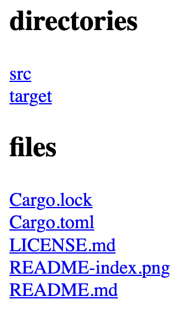

# picoserve

picoserve is a simple 0-dependency HTTP server that just serves files. There's
no authentication, no caching control, no uploading, and so on. You can just
GET files and, optionally, index directories for viewing.

## Installation

```sh
$ cargo install --git https://github.com/vivian/picoserve
```

## Usage

Start the pico server, which will by default serve the current directory and
bind to `127.0.0.1:5555`:

```sh
$ picoserve
= Listening on 127.0.0.1:5555
= Serving /Users/vivian/dev/picoserve
```

You can then GET files:

```sh
$ http get 127.0.0.1:5555/Cargo.toml
HTTP/1.1 200 OK
Content-Type: text/plain
Content-Type: 130

[package]
authors = ["Vivian Hellyer <vivian@hellyer.dev>"]
edition = "2018"
name = "picoserve"
version = "0.1.0"

[dependencies]

```

You can index directories for browser viewing on port 8080:

```sh
$ picoserve --index --port 8080
= Listening on 127.0.0.1:8080
= Serving /Users/vivian/dev/picoserve
= Indexing directories for browser file listing
```



### Flags

- `--host <value>`: set the host to bind to
- `--port <value>`: set the port to bind to
- `--dir <value>`: path to the directory to serve
- `--index`: enable an index for browser viewing

## License

ISC.
